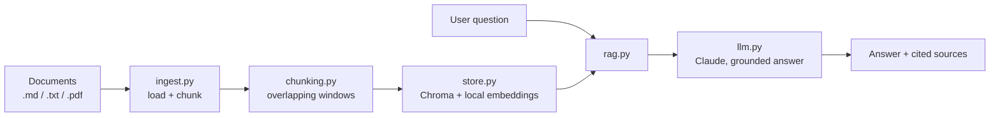

# Architecture

Ask-My-Docs is a deliberately small RAG system. Every component is one focused
module so the data flow is easy to follow and to test.

## Data flow

## Modules

| Module        | Responsibility                                                        |
| ------------- | -------------------------------------------------------------------- |
| `config.py`   | Settings from environment / `.env` (one source of truth).            |
| `chunking.py` | Pure text → overlapping chunks. No I/O, fully unit-tested.           |
| `store.py`    | Persistent Chroma collection; embeddings run locally (no API key).   |
| `ingest.py`   | Read files, chunk, upsert. Stable ids so re-ingest is idempotent.    |
| `llm.py`      | Build the grounded prompt and call Claude for the answer.            |
| `rag.py`      | Orchestrate retrieve → generate; return answer + contexts + sources. |
| `cli.py`      | `ingest` and `ask` commands.                                         |
| `metrics.py`  | Retrieval metrics (hit@k, MRR) — the testable core of evaluation.    |

## Design choices

- **Local embeddings, Claude for generation.** The index needs no extra API key,
  so a reviewer can `ingest` immediately; only answering/evaluating calls Claude.
- **Stable chunk ids** (`source::index`) make re-ingestion an upsert, not a
  duplicate-insert.
- **Evaluation is split** into deterministic retrieval metrics and an
  LLM-as-judge pass with structured output — see [`evals/`](../evals/README.md).
- **Pure core, thin shell.** Chunking and metrics are pure functions (unit-tested
  in CI without network); Chroma and Claude live behind small wrappers.

## Extending it

- Swap the embedding model (pass an `embedding_function` to `VectorStore`).
- Add a reranker between retrieval and generation.
- Add citations-with-spans or streaming responses in `llm.py`.
- Put a `streamlit` or `FastAPI` front end on `rag.answer_question`.
